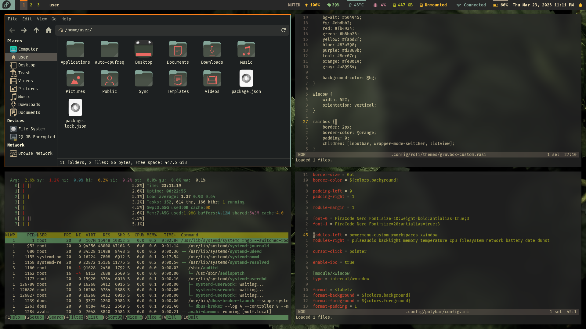
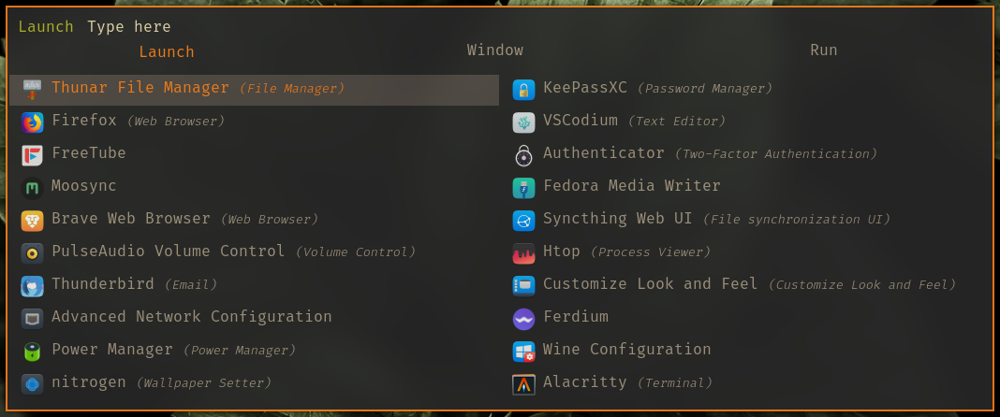
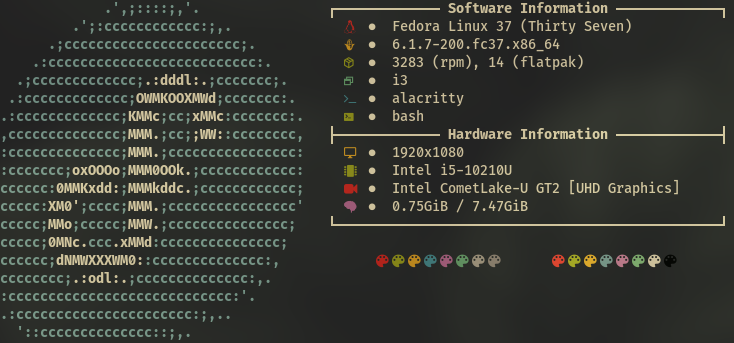

<h1 align="center">My Configuration for
  <a href="https://spins.fedoraproject.org/en/i3/">Fedora i3 Spin</a>
    
</h1>

| Fedora i3 Spin screenshot #1 | Fedora i3 Spin screenshot #2 |
|:------------:|:------------:|
|   |  |

| Polybar |
|:-------:|
|   |

| Rofi | Neofetch |
|:------------:|:------------:|
|   |  |

---

## Documentations
- [i3wm Documentation](https://i3wm.org/docs/)
- [Fedora Documentation](https://docs.fedoraproject.org/en-US/docs/)

## Essential Software & Utilities
- [Picom](https://github.com/yshui/picom) - A lightweight compositor for X11.
- [Polybar](https://github.com/polybar/polybar) - A fast and easy-to-use status bar. 
- [Alacritty](https://github.com/alacritty/alacritty) - A cross-platform, OpenGL terminal emulator.
- [Rofi](https://github.com/davatorium/rofi) - A window switcher, application launcher and dmenu replacement.
  - [Rofimoji](https://github.com/fdw/rofimoji) - Emoji, unicode and general character picker for rofi and rofi-likes.
  - [Greenclip](https://github.com/erebe/greenclip) - Simple clipboard manager to be integrated with rofi - Static binary available	
- [xfce4-power-manager](https://src.fedoraproject.org/rpms/xfce4-power-manager) - Xfce Power Manager uses the information and facilities provided by HAL to display icons and handle user callbacks in an interactive Xfce session. Xfce Power Preferences allows authorised users to set policy and change preferences.
- [Xbacklight](https://src.fedoraproject.org/rpms/xbacklight) - Xbacklight is used to adjust the backlight brightness where
supported. It finds all outputs on the X server supporting backlight brightness control and changes them all in the same way.
- [NetworkManager](https://src.fedoraproject.org/rpms/NetworkManager) - A system service that manages network interfaces and connections based on user or automatic configuration.
- [nm-connection-editor](https://rpmfind.net/linux/rpm2html/search.php?query=nm-connection-editor&submit=Search+...&system=&arch=) - A network connection configuration editor for NetworkManager.
- [nm-connection-editor-desktop](https://rpmfind.net/linux/rpm2html/search.php?query=nm-connection-editor-desktop&submit=Search+...&system=&arch=) - The desktop file for nm-connection-editor.
- [PulseAudio](https://src.fedoraproject.org/rpms/pulseaudio) - PulseAudio is a sound server for Linux and other Unix like operating systems. It is intended to be an improved drop-in replacement for the Enlightened Sound Daemon (ESOUND).
- [pavucontrol](https://src.fedoraproject.org/rpms/pavucontrol) - PulseAudio Volume Control (pavucontrol) is a simple GTK based volume control tool ("mixer") for the PulseAudio sound server. In contrast to classic mixer tools this one allows you to control both the volume of hardware devices and of each playback stream separately.
- [Thunar](https://src.fedoraproject.org/rpms/Thunar) - A modern file manager for the Xfce Desktop Environment.
  - [gvfs](https://src.fedoraproject.org/rpms/gvfs) - The gvfs package provides backend implementations for the gio framework in GLib. It includes ftp, sftp, cifs.
- [Flameshot](https://github.com/flameshot-org/flameshot) - Powerful yet simple to use screenshot software.
- [SimpleScreenRecorder](https://github.com/MaartenBaert/ssr) - SimpleScreenRecorder is a screen recorder for Linux.
- [Ristretto](https://github.com/xfce-mirror/ristretto) - Ristretto is an image viewer for the Xfce desktop environment. The Ristretto Image Viewer is an application that can be used to view and scroll through images, run a slideshow of images, open images with other applications like an image-editor or configure an image as the
desktop wallpaper.
- [ARandR](https://src.fedoraproject.org/rpms/arandr) - ARandR is designed to provide a simple visual front end for XRandR 1.2/1.3. Relative monitor positions are shown graphically and can be changed in a drag-and-drop way.
- [GParted](https://gparted.org/index.php) - GParted is a free partition editor for graphically managing your disk partitions.
- [GNOME Disks](https://src.fedoraproject.org/rpms/gnome-disk-utility) - GNOME Disks is a graphical front-end for udisks. 
- [Fedora Media Writer](https://src.fedoraproject.org/rpms/mediawriter) - A tool to write images of Fedora media to portable drives like flash drives or memory cards.
- [Blueman](https://src.fedoraproject.org/rpms/blueman) - Blueman is a tool to use Bluetooth devices.
- [lxpolkit](https://rpmfind.net/linux/rpm2html/search.php?query=config(lxpolkit)) - LXPolkit is a minimalized policykit authentication agent for the LXDE desktop.
- [CUPS](https://src.fedoraproject.org/rpms/cups) - CUPS printing system provides a portable printing layer for UNIX® operating systems. It has been developed by Apple Inc. to promote a standard printing solution for all UNIX vendors and users. CUPS provides the System V and Berkeley command-line interfaces.
- [system-config-printer](https://src.fedoraproject.org/rpms/system-config-printer) - system-config-printer is a graphical user interface that allows the user to configure a CUPS printer server.
- [FFmpeg](https://github.com/FFmpeg/FFmpeg) - FFmpeg is a collection of libraries and tools to process multimedia content such as audio, video, subtitles and related metadata.
- [Xarchiver](https://src.fedoraproject.org/rpms/xarchiver) - Xarchiver is a lightweight GTK frontend for manipulating 7z, arj, bzip2,
gzip, iso, rar, lha, tar, zip, RPM and deb files. It allows you to create
archives and add, extract, and delete files from them. Password protected
archives in the arj, 7z, rar, and zip formats are supported.
- [MPD](https://src.fedoraproject.org/rpms/python-mpd) - An MPD (Music Player Daemon) client library written in pure Python.
- [Git](https://src.fedoraproject.org/rpms/git) - Git is a fast, scalable, distributed revision control system with an
unusually rich command set that provides both high-level operations and full access to internals. The git rpm installs common set of tools which are usually using with small amount of dependencies. To install all git packages, including tools for integrating with other SCMs, install the git-all meta-package. 
- [Pip](https://developer.fedoraproject.org/tech/languages/python/pypi-installation.html) - Pip is the package installer for Python. You can use pip to install packages from the Python Package Index and other indexes.
- [Ruby](https://pypi.org/project/ruby/) - A tool for translating text from source grammar to target grammar (context-free) with corresponding dictionary.
- [Node.js](https://developer.fedoraproject.org/tech/languages/nodejs/nodejs.html) - Open-source cross-platform server-side JavaScript runtime environment.
- [i3lock](https://src.fedoraproject.org/rpms/i3lock) - i3lock is a simple screen locker like slock. After starting it, you will see a white screen (you can configure the color/an image). You can return to your screen by entering your password.
- [scrot](https://src.fedoraproject.org/rpms/scrot) - scrot is a simple command line screen capture utility.
- [ImageMagick](https://src.fedoraproject.org/rpms/ImageMagick) - ImageMagick is an image display and manipulation tool for the X Window System. ImageMagick can read and write JPEG, TIFF, PNM, GIF, and Photo CD image formats. It can resize, rotate, sharpen, color reduce, or add special effects to an image, and when finished you can either save the completed work in the original format or a different one. ImageMagick also includes command line programs for creating animated or transparent .gifs, creating composite images, creating thumbnail images, and more.
- [calcurse](https://src.fedoraproject.org/rpms/calcurse) - Calcurse is a text-based calendar and scheduling application. It helps
keep track of events, appointments, and everyday tasks.
- [wttr.in](https://github.com/chubin/wttr.in) - wttr.in is a console-oriented weather forecast service that supports various information representation methods like terminal-oriented ANSI-sequences for console HTTP clients (curl, httpie, or wget), HTML for web browsers, or PNG for graphical viewers.

## Autotiling
- [autotiling](https://github.com/nwg-piotr/autotiling) - Script for sway and i3 to automatically switch the horizontal / vertical window split orientation
```console
pip install autotiling==1.8
```
## Web Browsers
- [Firefox](https://www.mozilla.org/en-US/firefox/new/) - A free and open-source web browser developed by the Mozilla Foundation. No shady privacy policies or back doors for advertisers. Just a lightning fast browser that doesn’t sell you out.
- [Brave](https://brave.com/) - The Brave browser is a fast, private and secure web browser for PC, Mac and mobile.

## Text Editors & IDEs
- [Helix](https://github.com/helix-editor/helix) - A post-modern modal text editor.
- [nano](https://www.nano-editor.org/) - GNU nano is a small editor for on the terminal.
- [VSCodium](https://vscodium.com/) - Binary releases of VS Code without MS branding/telemetry/licensing.
  - [Gruvbox Theme](https://open-vsx.org/extension/jdinhlife/gruvbox) - Color Theme: Gruvbox Dark Hard
- [Geany](https://src.fedoraproject.org/rpms/geany) - Geany is a small and fast integrated development environment with basic
features and few dependencies to other packages or Desktop Environments.

## Optimization
- [TLP](https://linrunner.de/tlp/) - Optimize Linux Laptop Battery Life
- [auto-cpufreq](https://github.com/AdnanHodzic/auto-cpufreq) - Automatic CPU speed & power optimizer for, Linux based on active 
monitoring of a laptop's battery state, CPU usage, CPU temperature and 
system load. Ultimately allowing you to improve battery life without 
making any compromises.
- [ZRAM](https://src.fedoraproject.org/rpms/zram) - ZRAM is a Linux block device that can be used for compressed swap in memory. It's useful in memory constrained devices. This provides a service to setup ZRAM as a swap device based on criteria such as available memory.

## Essential Security Utilities
- [UFW](https://src.fedoraproject.org/rpms/ufw) - Ufw stands for Uncomplicated Firewall, and is program for managing a netfilter firewall. It provides a command line interface and aims to be 
uncomplicated and easy to use.
- [ClamAV](https://github.com/Cisco-Talos/clamav) - ClamAV® is an open source antivirus engine for detecting trojans, viruses, malware & other malicious threats.
- [chkrootkit](http://www.chkrootkit.org/) - chkrootkit is a tool to locally check for signs of a rootkit.
- [Lynis](https://github.com/CISOfy/lynis) - Lynis - Security auditing tool for Linux, macOS, and UNIX-based systems. Assists with compliance testing (HIPAA/ISO27001/PCI DSS) and system 
hardening. Agentless, and installation optional.
- [rkhunter](https://sourceforge.net/projects/rkhunter/) - Rootkit Hunter, security monitoring and analyzing tool.
- [Fail2Ban](https://src.fedoraproject.org/rpms/fail2ban) - Fail2Ban scans log files and bans IP addresses that makes too many password failures. It updates firewall rules to reject the IP address. These rules can be defined by the user. Fail2Ban can read multiple log files such as sshd or Apache web server ones.

## Customization
- [LXAppearance](https://src.fedoraproject.org/rpms/lxappearance) - LXAppearance is a new GTK+ theme switcher developed for LXDE, the Lightweight X11 Desktop Environment.
  #### Default font:
    - Family: FiraCode Nerd Font
    - Size: 10
    - Style: Regular

- [feh](https://github.com/derf/feh) - feh is a light-weight, configurable and versatile image viewer.
- [Nitrogen](https://src.fedoraproject.org/rpms/nitrogen) - Background browser and setter for X windows.
- [Nerd Fonts](https://www.nerdfonts.com/) - Iconic font aggregator, collection, & patcher.
- [Oh My Posh](https://ohmyposh.dev/) - A prompt theme engine for any shell.
- [Starship](https://starship.rs/) - The minimal, blazing-fast, and infinitely customizable prompt for any shell!

#### Gruvbox GTK Theme & Gruvbox Icons Theme
 Install `gtk-murrine-engine`
 ```console
 sudo dnf install gtk-murrine-engine
 ```
- [Gruvbox GTK Theme](https://www.xfce-look.org/p/1681313/) - Theme version: Gruvbox-Dark-BL
- [Gruvbox Icons Theme](https://www.xfce-look.org/p/1681460/) - Icon pack version: Gruvbox-Dark

## System Monitoring and Information Utilities
- [htop](https://github.com/htop-dev/htop) - An interactive process viewer.     
- [btop](https://github.com/aristocratos/btop) - A monitor of resources
- [nmon](https://src.fedoraproject.org/rpms/nmon) - nmon is a systems administrator, tuner, benchmark tool, which provides information about CPU, disks, network, etc., all in one view.
- [lm_sensors](https://src.fedoraproject.org/rpms/lm_sensors) - The lm_sensors package includes a collection of modules for general SMBus
access and hardware monitoring.
- [collectl](https://src.fedoraproject.org/rpms/collectl) - A utility to collect Linux performance data.
- [Smartctl](https://fedoraproject.org/wiki/Smartctl) - This is a fault monitoring and testing interface that can be quite useful, both as a way to monitor the health of your disks and test them.
- [Neofetch](https://github.com/dylanaraps/neofetch) - A command-line system information tool written in bash 3.2+

## Media Players & Utilities
- [VLC](https://www.videolan.org/vlc/) - VLC is a free and open source cross-platform multimedia player and framework that plays most multimedia files, and various streaming protocols.                
- [Lollypop](https://src.fedoraproject.org/rpms/lollypop) - A GNOME music playing application.
- [Moosync](https://github.com/Moosync/Moosync) - A simple music player capable of playing local audio or from Youtube or Spotify.
- [Playerctl](https://github.com/altdesktop/playerctl) - Playerctl is a command-line utility and library for controlling media players that implement the MPRIS D-Bus Interface Specification.

## Wine
- [Wine](https://www.winehq.org/) - Wine (originally an acronym for "Wine Is Not an Emulator") is a 
compatibility layer capable of running Windows applications on several 
POSIX-compliant operating systems, such as Linux, macOS, & BSD. 
Instead of simulating internal Windows logic like a virtual machine or 
emulator, Wine translates Windows API calls into POSIX calls on-the-fly,
eliminating the performance and memory penalties of other methods and 
allowing you to cleanly integrate Windows applications into your 
desktop.
- [Winetricks](https://github.com/Winetricks/winetricks) - Winetricks is an easy way to work around problems in Wine.
      
## Other Software & Utilities
- [KeePassXC](https://keepassxc.org/) - A Cross-Platform Password Manager
- [VeraCrypt](https://www.veracrypt.fr/en/Home.html) - VeraCrypt is a free open source disk encryption software for Windows, Mac OSX and Linux.
- [Cryptomator](https://cryptomator.org/) - Encrypt Dropbox, Google Drive, and any other cloud. Cryptomator is free and open source.
- [Syncthing](https://syncthing.net/) - A continuous file synchronization program. It synchronizes files between two or more computers in real time, safely protected from prying eyes.
- [Authenticator](https://flathub.org/apps/details/com.belmoussaoui.Authenticator) - Simple application for generating Two-Factor Authentication Codes.
  - [gnome-keyring](https://src.fedoraproject.org/rpms/gnome-keyring) - The gnome-keyring session daemon manages passwords and other types of
secrets for the user, storing them encrypted with a main password.
Applications can use the gnome-keyring library to integrate with the keyring.
- [Thunderbird](https://src.fedoraproject.org/rpms/thunderbird) - Mozilla Thunderbird is a standalone mail and newsgroup client.
- [Ferdium](https://github.com/ferdium/ferdium-app) - All your services in one place, built by the community
- [VirtualBox](https://www.virtualbox.org/) - Oracle VM VirtualBox is a type-2 hypervisor for x86 virtualization developed by Oracle Corporation.
- [Ranger](https://github.com/ranger/ranger) - A VIM-inspired filemanager for the console.
- [AppImageLauncher](https://github.com/TheAssassin/AppImageLauncher) - Helper application for Linux distributions serving as a kind of "entry point" for running and integrating AppImages.
- [GIMP](https://www.gimp.org/) - A free and open-source raster graphics editor.
- [Inkscape](https://inkscape.org/) - A free and open-source vector graphics editor used to create vector images.
- [Krita](https://krita.org/en/) - A free and open source painting program.
- [BleachBit](https://src.fedoraproject.org/rpms/bleachbit) - Delete traces of your computer activity and other junk files to free
disk space and maintain privacy.
- [PeaZip](https://flathub.org/apps/details/io.github.peazip.PeaZip) - PeaZip is free file archiver utility, based on Open Source technologies of 7-Zip, p7zip, Brotli, FreeArc, PAQ, Zstandard, and PEA projects. Cross-platform, full-featured but user-friendly alternative to WinRar, WinZip and similar general purpose archive manager applications, open and extract 200+ archive formats: 001, 7Z, ACE, ARC, ARJ, BR, BZ2, CAB, DMG, GZ, ISO, LHA, PAQ, PEA, RAR, TAR, UDF, WIM, XZ, ZIP, ZIPX, ZST - view full list of supported archive file formats for archiving and for extraction.
- [Joplin](https://joplinapp.org/) - A free, open source note taking and to-do application, which can handle a large number of notes organised into notebooks.
- [Metadata Cleaner](https://flathub.org/apps/details/fr.romainvigier.MetadataCleaner) - View and clean metadata in files.
- [qBittorrent](https://src.fedoraproject.org/rpms/qbittorrent) - A Bittorrent client using rb_libtorrent and a Qt6 Graphical User Interface. It aims to be as fast as possible and to provide multi-OS, unicode support.
- [GitHub Desktop](https://flathub.org/apps/details/io.github.shiftey.Desktop) - This version of GitHub Desktop is a fork that adds support for Linux.
- [LibreOffice](https://src.fedoraproject.org/rpms/libreoffice) - LibreOffice is an Open Source, community-developed, office productivity suite.
It includes the key desktop applications, such as a word processor, spreadsheet, presentation manager, formula editor and drawing program, with a user interface and feature set similar to other office suites.  Sophisticated and flexible, LibreOffice also works transparently with a variety of file formats, including Microsoft Office File Formats.
- [prename](https://src.fedoraproject.org/rpms/prename) - Prename renames the file names supplied according to the rule specified as
the first argument. The argument is a Perl expression which is expected
to modify the $_ string for at least some of the file names specified.

<br>

## Enable [RPM Fusion](https://rpmfusion.org/) Repositories
#### Free Repository
```console
sudo dnf install https://download1.rpmfusion.org/free/fedora/rpmfusion-free-release-$(rpm -E %fedora).noarch.rpm -y && dnf upgrade -y
```
#### Nonfree Repository
```console
sudo dnf install https://download1.rpmfusion.org/nonfree/fedora/rpmfusion-nonfree-release-$(rpm -E %fedora).noarch.rpm -y && dnf upgrade -y
```

<br>

## Howto/NVIDIA - RPM Fusion
[Install NVIDIA driver on Fedora](https://rpmfusion.org/Howto/NVIDIA)

<br>

## Enable [Flathub](https://flathub.org/home) on Fedora
```console
flatpak remote-add --if-not-exists flathub https://flathub.org/repo/flathub.flatpakrepo
```

<br>

## Thunar and GVFS Installation
```console
sudo dnf install thunar*
sudo dnf install gvfs*
```

<br>

## FFmpeg Installation
This will also fix laggy video playback in Firefox.
```console
sudo dnf install https://mirrors.rpmfusion.org/free/fedora/rpmfusion-free-release-$(rpm -E %fedora).noarch.rpm
sudo dnf install ffmpeg ffmpeg-libs
```

<br>

## CUPS Installation and Enabling Service
You can directly access the Administration section of the web browser interface by going to http://localhost:631/admin.
```console
sudo dnf install cups*
sudo dnf install system-config-printer
sudo systemctl start cups.service
sudo systemctl enable cups.service
```

<br>

## TLP Installation and Enabling Service
[TLP Installation](https://linrunner.de/tlp/installation/fedora.html)
```console
sudo dnf install tlp tlp-rdw
sudo dnf remove power-profiles-daemon
sudo systemctl start tlp.service
sudo systemctl enable tlp.service
sudo systemctl mask systemd-rfkill.service systemd-rfkill.socket
```

<br>

## ZRAM Installation and Enabling Service
```console
sudo dnf install zram zram-generator-defaults zram-generator
sudo systemctl start zram-swap.service
sudo systemctl start zram-swap.service
sudo systemctl enable zram-swap.service
reboot
```

<br>

## Install and Apply Default Restrictive Policy for UFW
```console
sudo dnf install ufw
sudo systemctl start ufw.service
sudo systemctl enable ufw.service
sudo ufw enable
sudo ufw default deny incoming
```

<br>

## ClamAV Installation and Enabling Service
[How to Install ClamAV on Fedora Linux](https://www.linuxcapable.com/install-clamav-on-fedora-linux/)
```console
sudo dnf upgrade --refresh
sudo dnf install clamav clamd clamav-update -y
sudo systemctl stop clamav-freshclam
sudo systemctl enable clamav-freshclam --now
```

<br>

## Fail2Ban Installation and Enabling Service
```console
sudo dnf install fail2ban
sudo systemctl start fail2ban
sudo systemctl enable fail2ban
```

<br>

## Enable auto-cpufreq Service
```console
sudo systemctl start auto-cpufreq
sudo systemctl enable auto-cpufreq
```

<br>

## [Installing Plugins For Playing Movies and Music](https://docs.fedoraproject.org/en-US/quick-docs/assembly_installing-plugins-for-playing-movies-and-music/)
#### Prerequisites
- [Enable the RPMFusion repositories.](https://docs.fedoraproject.org/en-US/quick-docs/setup_rpmfusion/)

#### Procedure
- Use the dnf utility to install packages that provide multimedia libraries:
```console
sudo dnf install gstreamer1-plugins-{bad-\*,good-\*,base} gstreamer1-plugin-openh264 gstreamer1-libav --exclude=gstreamer1-plugins-bad-free-devel
sudo dnf install lame\* --exclude=lame-devel
sudo dnf group upgrade --with-optional Multimedia
```

<br>

## Intel - Screen Tearing Fix
More information on the [ArchWiki](https://wiki.archlinux.org/title/intel_graphics#Tearing).<br>
Create a configuration file in `/etc/X11/xorg.conf.d` named `20-intel.conf`
```console
sudo touch /etc/X11/xorg.conf.d/20-intel.conf
```
Add the following to the new configuration file:
```
Section "Device"
  Identifier "Intel Graphics"
  Driver "Intel"
  Option "TearFree" "true"
EndSection
```
`TearFree` may not work when `SwapbuffersWait` is `false`.<br>
For Intel UHD 620 or 630 add `Option "TripleBuffer" "true"` to make `TearFree` work.

Then reboot.

<br>

## NVIDIA - Screen Tearing Fix
Install `nvidia-settings` and run it as sudo.
```console
sudo dnf install nvidia-settings && nvidia-settings
```
- Go to **X Server Display Configuration > Advanced**
- Enable **Force Full Composition Pipeline**
- Apply and Save to Configuration File.
- Reboot
